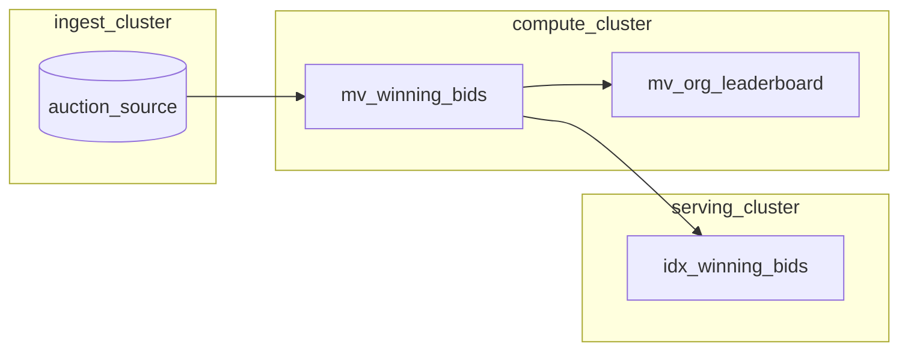
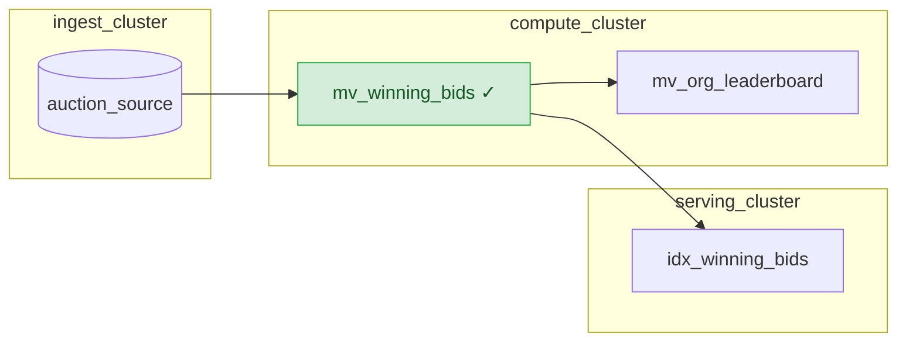


This feature is only recommended for use in development environments. It


This guide walks you through the steps required to modify the definition of an existing materialized view, while preserving all downstream dependencies.

Materialize is able to replace a materialized view in place, by calculating the *diff* between the original and the replacement. Once applied, the *diff* flows downstream to all dependent objects.

In this guide, you will:
1. Set up a data source.
2. Create a materialized view and dependent objects (downstream materialized
   views and indexes).
3. Create a replacement materialized view.
4. Apply the replacement and verify the results.

## Guide

### Before you begin

Before using this guide, you should be familiar with:

- [Sources](/concepts/sources/) and how data flows into Materialize
- [Views and materialized views](/concepts/views/)
- [Indexes](/concepts/indexes/) and how they improve query performance
- [Clusters](/concepts/clusters/) and compute resource management

### Step 0. Create clusters

This guide uses a [three-tier cluster architecture](/manage/operational-guidelines/#three-tier-architecture),
with separate clusters for ingestion, computation, and serving.



Create separate clusters for ingestion, computation, and serving.
```mzsql
-- Create an ingestion cluster
CREATE CLUSTER ingest_cluster SIZE = 'M.1-small';

-- Create a compute cluster
CREATE CLUSTER compute_cluster SIZE = 'M.1-small';

-- Create a serving cluster
CREATE CLUSTER serving_cluster SIZE = 'M.1-small';
```


Create separate clusters for ingestion, computation, and serving.
```mzsql
-- Create an ingestion cluster
CREATE CLUSTER ingest_cluster SIZE = '300cc';

-- Create a compute cluster
CREATE CLUSTER compute_cluster SIZE = '300cc';

-- Create a serving cluster
CREATE CLUSTER serving_cluster SIZE = '300cc';
```


### Step 1. Set up a data source

For this guide, we'll use the [Materialize auction load generator](/sql/create-source/load-generator/#creating-an-auction-load-generator) as our data source.

1. Create a schema for the project:

   ```mzsql
   -- Create a schema for the project
   CREATE SCHEMA IF NOT EXISTS auction_house;
   ```

1. Create the source in the ingestion cluster:

   ```mzsql
   -- Create auction load generator source
   CREATE SOURCE auction_house.auction_source
     IN CLUSTER ingest_cluster
     FROM LOAD GENERATOR AUCTION (TICK INTERVAL '1s')
     FOR ALL TABLES;
   ```

   This creates several tables (referred to as subsources in
   Materialize)including `auctions`, `bids`, `users`, and `organizations` that
   simulate a live auction environment.

### Step 2. Create the materialized view and its dependent objects

1. In the `compute_cluster`, create a materialized view `mv_winning_bids` that
   identifies winning bids for completed auctions:

   ```mzsql
   -- Materialized view: winning bids
   -- Joins auction data to find the highest bid for each completed auction
   CREATE MATERIALIZED VIEW auction_house.mv_winning_bids
     IN CLUSTER compute_cluster
   AS
   SELECT
       a.id AS auction_id,
       a.item,
       a.end_time,
       b.id AS winning_bid_id,
       b.amount AS winning_amount,
       b.bid_time AS winning_bid_time,
       u.id AS winner_id,
       u.name AS winner_name,
       o.id AS winner_org_id,
       o.name AS winner_org_name
   FROM auction_house.auctions a
   JOIN auction_house.bids b ON a.id = b.auction_id
   JOIN auction_house.users u ON b.buyer = u.id
   JOIN auction_house.organizations o ON u.org_id = o.id
   WHERE a.end_time < mz_now()
   AND b.amount = (
       SELECT MAX(b2.amount)
       FROM auction_house.bids b2
       WHERE b2.auction_id = a.id
   );
   ```

1. In the `compute_cluster`, create a downstream materialized view
   `mv_org_leaderboard` that uses `mv_winning_bids` to aggregate winning bids by
   organization:

   ```mzsql
   -- Materialized view: organization leaderboard
   -- Aggregates winning bids by organization (depends on the winning bids view)
   CREATE MATERIALIZED VIEW auction_house.mv_org_leaderboard
     IN CLUSTER compute_cluster
   AS
   SELECT
       winner_org_id AS org_id,
       winner_org_name AS org_name,
       COUNT(*) AS total_wins,
       SUM(winning_amount) AS total_spent,
       AVG(winning_amount)::NUMERIC(10,2) AS avg_winning_bid,
       MAX(winning_amount) AS highest_winning_bid,
       MIN(winning_amount) AS lowest_winning_bid
   FROM auction_house.mv_winning_bids
   GROUP BY winner_org_id, winner_org_name;
   ```

1. In the `serving_cluster`, create an index on `mv_winning_bids` to make
results available in memory for fast queries:

   ```mzsql
   -- Index on mv_winning_bids.
   -- Makes results available in memory within the serving cluster
   CREATE INDEX idx_winning_bids
     IN CLUSTER serving_cluster
     ON auction_house.mv_winning_bids (auction_id);
   ```

At this point, you have:
- A source generating auction data;
- A materialized view `mv_winning_bid` that computes winning bids for auctions;
- A downstream materialized view `mv_org_leaderboard` that  aggregates winning
  bids results by organization;
- An index `idx_winning_bids` on `mv_winning_bids` for seving winning bid
  queries



### Step 3. Create a replacement materialized view.

Now, suppose you want to modify `mv_winning_bids` to only include bids above
a certain threshold. Instead of dropping and recreating the view (which would
require recreating all downstream objects), you can create a replacement.

1. In the `compute_cluster`, use [`CREATE REPLACEMENT MATERIALIZED
VIEW`](/sql/create-materialized-view/) to create `mv_winning_bids_v2` with the
updated materialized view defintion:

   ```mzsql
   -- Create a replacement for the winning bids view
   CREATE REPLACEMENT MATERIALIZED VIEW auction_house.mv_winning_bids_v2
     FOR auction_house.mv_winning_bids
     IN CLUSTER compute_cluster
   AS
   SELECT
       a.id AS auction_id,
       a.item,
       a.end_time,
       b.id AS winning_bid_id,
       b.amount AS winning_amount,
       b.bid_time AS winning_bid_time,
       u.id AS winner_id,
       u.name AS winner_name,
       o.id AS winner_org_id,
       o.name AS winner_org_name
   FROM auction_house.auctions a
   JOIN auction_house.bids b ON a.id = b.auction_id
   JOIN auction_house.users u ON b.buyer = u.id
   JOIN auction_house.organizations o ON u.org_id = o.id
   WHERE a.end_time < mz_now()
   AND b.amount = (
       SELECT MAX(b2.amount)
       FROM auction_house.bids b2
       WHERE b2.auction_id = a.id
   )
   AND b.amount > 50;  -- New filter: only include winning bids above 50
   ```

   The replacement view:
   - References the original view using `FOR auction_house.mv_winning_bids`.
   - Specifies the same output schema as the original view (i.e., same column
     names, column types, column order, nullability, and keys) in its `SELECT`
     statement.
   - Computes results independently while the original continues serving
     queries.

   

   {}
   
1. Before applying the replacement view, wait for it to fully hydrate. To query
   the replacement view's hydration status:

   ```mzsql
   -- Check hydration status of the replacement view
   SELECT
        mv.name,
        h.hydrated
    FROM mz_catalog.mz_materialized_views AS mv
    JOIN mz_internal.mz_hydration_statuses AS h ON (mv.id = h.object_id)
    WHERE mv.name = 'mv_winning_bids_v2';
   ```

   Wait until `hydrated` returns `true` before proceeding. The time required
   depends on the size of your data and the complexity of the query.

### Step 4. Apply the replacement and verify the results

Once the replacement materialized view is fully hydrated, you can use [`ALTER
MATERIALIZED VIEW ... APPLY REPLACEMENT`](/sql/alter-materialized-view/) to
replace the original materialized view.

{}



{}




```mzsql
-- Apply the replacement
ALTER MATERIALIZED VIEW auction_house.mv_winning_bids
  APPLY REPLACEMENT auction_house.mv_winning_bids_v2;
```

After this command completes:
- The original view now uses the updated query definition.
- The replacement view is automatically dropped.
- Downstream objects will receive the diff and begin processing it.
- No downstream objects need to be recreated.



You can confirm the materialized view is now using the updated definition (and
reflected in its index):

```mzsql
-- Query the updated view for winning bids <= 50. This should return 0 rows
SELECT * FROM auction_house.mv_winning_bids
WHERE winning_amount <= 50;
```

You can also confirm that the downstream leaderboard view reflects the filtered data:

```mzsql
-- Verify downstream view received updates
-- The lowest_winning_bid should be greater than 50
SELECT * FROM auction_house.mv_org_leaderboard
ORDER BY lowest_winning_bid ASC
LIMIT 1;
```

## Best practices

### Size up clusters before applying a replacement

{}

Since applying a replacement temporarily increases memory usage, consider
[resizing your clusters](/sql/alter-cluster/#resizing) to a larger size before
applying the replacement. This helps ensure sufficient memory is available while
the diff is being processed and will prevent out of memory errors.

You can resize back down after the replacement is complete. To automate this
process, you can consider using [mz-clusterctl](https://github.com/MaterializeInc/mz-clusterctl),
which will auto-scale cluster sizes based on cluster activity.

### Drop unused replacement

The [`ALTER MATERIALIZED VIEW ... APPLY
REPLACEMENT`](/sql/alter-materialized-view/) command drops the replacement view
as part of its operation. However, if you decide not to apply a replacement,
instead of keeping unused replacement views around, you can manually drop it:

```mzsql
-- Drop the replacement without applying
DROP MATERIALIZED VIEW auction_house.mv_winning_bids_v2;
```

## Troubleshooting

{}

## Related pages

- [Updating materialized views](/transform-data/updating-materialized-views/)
- [`CREATE MATERIALIZED VIEW`](/sql/create-materialized-view)
- [Views](/concepts/views/)
- [Indexes](/concepts/indexes/)
- [Clusters](/concepts/clusters/)
